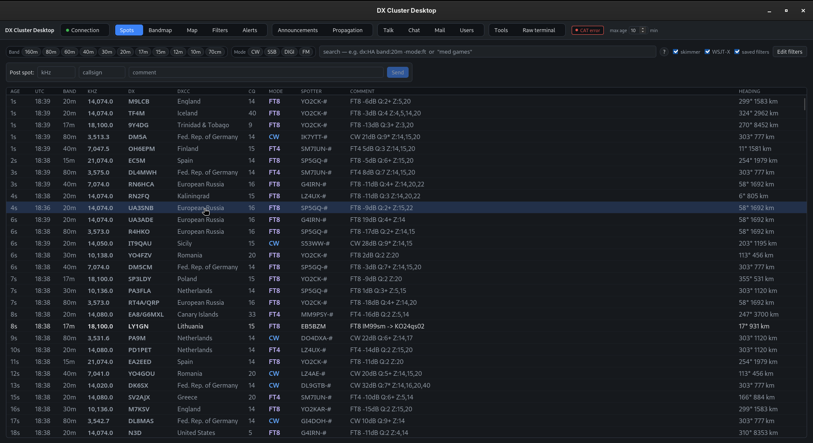
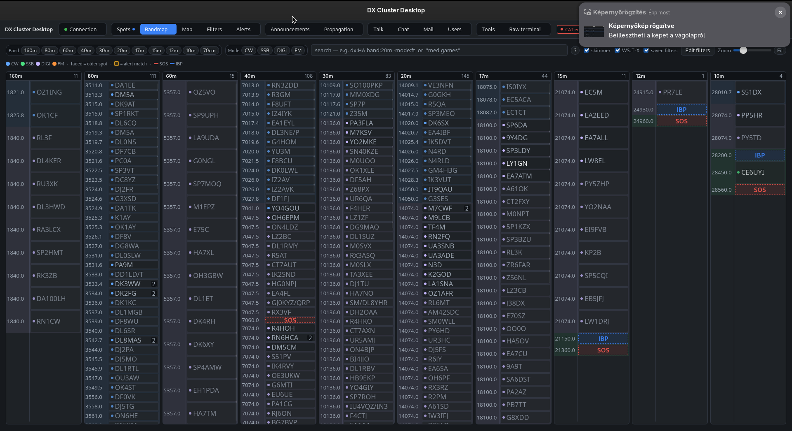
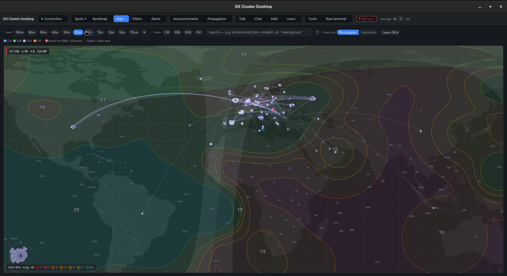
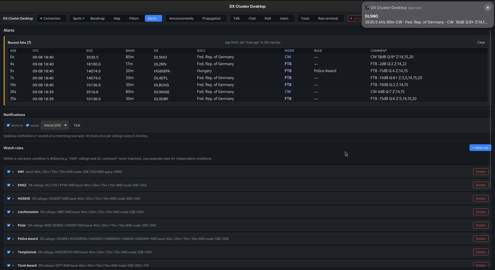
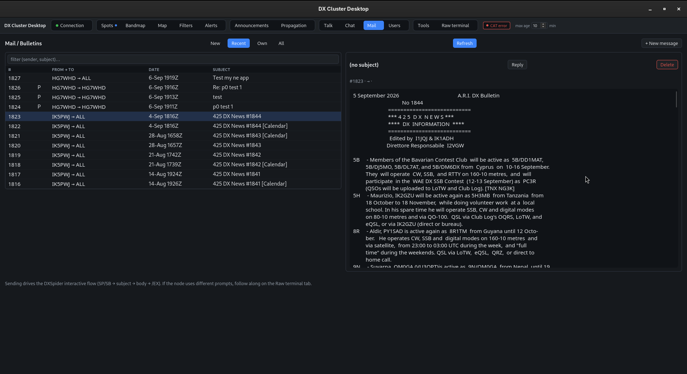
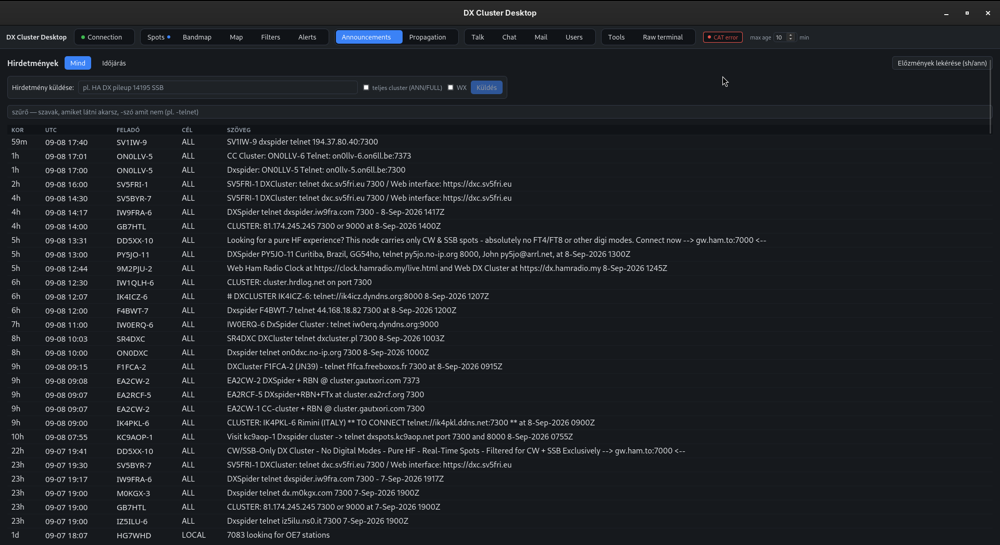
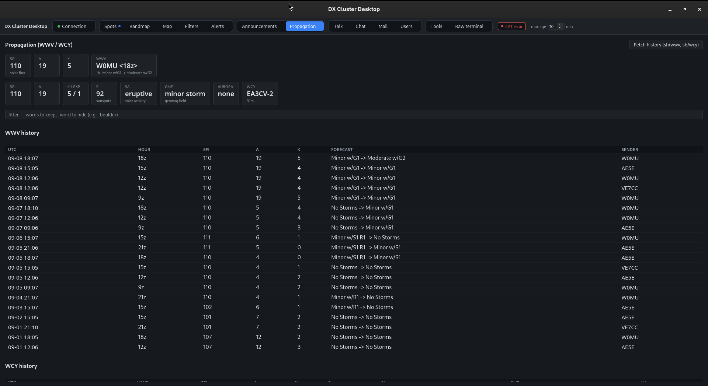
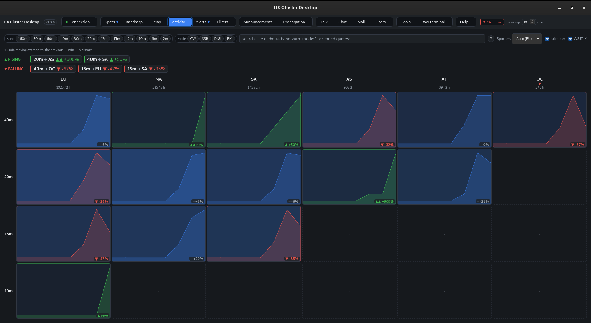
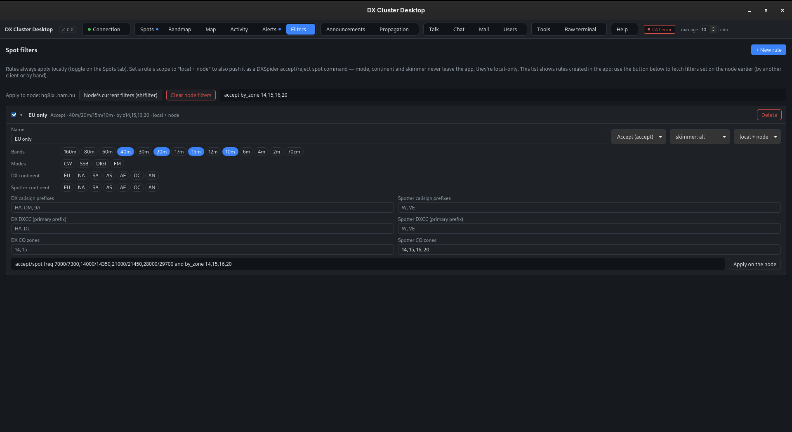

# DX Cluster Desktop

**A friendly, modern desktop client for ham-radio DX clusters — no cluster
commands to memorise, ever.**

DX clusters are one of the most useful tools in DXing and contesting, but the
classic way to use them is a Telnet window and a cheat-sheet of cryptic
commands. DX Cluster Desktop replaces that with clickable tables, a live
bandmap, a propagation-aware world map, alerts, and a full mail/talk/chat
client — all driven from the GUI. Point-and-click to spot a station, tune your
radio, or set up a rare-DX alert.

Runs on **Windows, macOS and Linux**. Free and open source (MIT).

➡️ **[Download the latest release](https://github.com/dacrhu/dx-cluster-desktop/releases)**
· **[User manual](user-manual/en/README.md)** · **[Help translate it](TRANSLATING.md)**

---



## Why you'll like it

- **Everything is point-and-click.** Every cluster feature — spots, filters,
  announcements, WWV/WCY, talk, chat, mail, bulletins and node preferences like
  skimmer spots — is a table, a form or a clickable row. A raw terminal is
  there too, for when you want it.
- **A spot table that keeps up.** Virtualised, instant local filtering, a proper
  [search query language](user-manual/en/search-query.md) (`dx:VP8 band:20m cw`,
  `re:/MM$`), freeze-on-scroll so incoming spots never move what you're reading,
  mode colour-coding with real sub-modes (FT8, RTTY, SSTV…).
- **A real bandmap.** One lane per band, stations laid out by frequency, band-plan
  shading, many-skimmer spots collapsed into one row, SOS and beacon-project
  reference markers.
- **A world map that shows propagation.** Grey-line, aurora, a measured-MUF layer
  blending a solar model with live ionosonde data, band openings, a bearing
  rose, and a **"who is hearing me right now"** layer.
- **A band-activity matrix.** A band × continent grid with a sparkline and
  rising/falling trend in every cell — a 15-minute moving average of the spot
  feed, scoped to spotters on your own continent so it reflects what's workable
  from where you are. See at a glance that 40 m is opening to Europe while 15 m
  to North America fades.
- **Alerts that find the DX for you.** Watch lists → desktop notification + sound,
  a logged hit list, live-row tinting. Match by prefix, or by an exact
  callsign list (for hunting specific stations, e.g. an awards chase) that
  won't misfire on a longer callsign sharing the same letters. De-duped so a
  pileup of skimmer spots notifies once.
- **Full messaging.** Talk threads, group chat/conference, and a complete
  mail & bulletin client (read, compose, reply, delete) with a local cache.
- **Rig control and logging hand-off.** Full CAT rig control over serial/USB or
  a network link — tune to a spot, split-aware, follow the radio on the
  bandmap; plus a one-click "Prepare QSO" that pre-fills QLog / Log4OM /
  JTAlert / GridTracker. It drives the rig through Hamlib's `rigctld` (the one
  piece you install yourself); on a serial rig the app starts and supervises it
  for you.
- **Extra ears, if you want them.** Optional read-only feeds: the Reverse Beacon
  Network, PSK Reporter ("who hears me"), and a local WSJT-X UDP listener
  ("what my radio hears").
- **Speaks your language.** English, Hungarian and German out of the box, and
  [community-translatable](TRANSLATING.md) without writing code.
- **Self-contained.** One installer per platform, built by the release workflow.
  Every library, the web runtime and all reference data are inside it — nothing
  else to install to run the app. (The single exception is `rigctld`, the
  Hamlib program that CAT rig control drives — a separate program, not a
  library. [Details below](#rig-control-needs-hamlib-rigctld-not-bundled).)

## Screenshots

|                                                       |                                                   |
| ----------------------------------------------------- | ------------------------------------------------- |
|              |            |
| _Per-band bandmap with band-plan shading_             | _Propagation-aware world map_                     |
|                |                |
| _Watch-list alerts and hit log_                       | _Mail & bulletin client_                          |
|  |  |
| _Announcements with include/exclude search_           | _Solar-terrestrial data: WWV & WCY_               |
|       |     |
| _Band × continent activity matrix with trends_        | _Reusable local and node-side spot filters_       |

## Install

Download the build for your platform from the
**[Releases page](https://github.com/dacrhu/dx-cluster-desktop/releases)**:

| Platform                      | File                          |
| ----------------------------- | ----------------------------- |
| Windows 10/11                 | `.msi` or `.exe`              |
| macOS (Apple Silicon / Intel) | `.dmg`                        |
| Linux                         | `.AppImage`, `.deb` or `.rpm` |

Each build is self-contained — the Rust backend, the UI, the web runtime
(WebView2 on Windows, the system WebView on macOS, WebKitGTK on Linux) and all
reference data ride along in the installer. See
[Getting started](user-manual/en/getting-started.md) for per-platform notes.

### Rig control needs Hamlib (`rigctld` not bundled)

CAT rig control is a full feature of the app — over a serial/USB cable or a
network link. It drives the radio through **`rigctld`** from
[Hamlib](https://hamlib.github.io/), and that is the **one** component not
shipped in the installer. `rigctld` is not a library the app links against — it
is a standalone program that owns the connection to your radio, and the app
talks to it over a local socket. So install Hamlib yourself
(`dnf install hamlib` / `apt install libhamlib-utils` / `brew install hamlib` /
Hamlib for Windows).

For a **serial-connected radio** that's all you need — pick your rig model, the
serial port and the baud rate in the app, and it launches and manages its own
`rigctld` in the background. If you already run `rigctld` yourself (or reach the
rig over the network), point the app at its host and port instead.

Rig control is off until you switch it on in Settings, and nothing else in the
app depends on Hamlib. Details in
[Rig control and logging](user-manual/en/rig-and-logging.md).

## Documentation

The full **[user manual](user-manual/en/README.md)** covers every panel. You can
also read it inside the app — the **Help** tab renders the same pages (live from
GitHub, with an offline copy in the release).

## Translating

The entire interface is translatable by editing text files on GitHub — no
programming required. See **[TRANSLATING.md](TRANSLATING.md)**.

---

## For developers

<details>
<summary>Stack, layout, building from source</summary>

### Stack

- **Backend:** Rust + [Tauri 2](https://tauri.app) (tokio async). Owns the
  Telnet connections, line parsing, command building, `cty.dat` + geo math,
  SQLite store, alerts.
- **Frontend:** React + TypeScript + Vite. Panels, shared widgets, Zustand
  store, thin IPC wrappers.
- **Storage:** SQLite (spot history / search) + Tauri store (profiles,
  settings) + OS keyring (passwords).

### Layout

- `crates/dxcluster-core/` — transport-agnostic logic (telnet framing, login
  state machine, parsers, band/mode heuristics, `cty.dat` + geo, SQLite store,
  filter/command builders). Fast unit tests, no webview dependency.
- `src-tauri/` — the Tauri shell: `#[tauri::command]` surface + `cluster://*`
  events, reference-data updaters, the optional feeds (RBN/PSKR/WSJT-X), CAT and
  log-push.
- `src/` — the React UI (`panels/`, `components/`, `lib/`, `store/`, `i18n/`).

### Prerequisites

- [Node.js](https://nodejs.org/) 20+ and [pnpm](https://pnpm.io/) 10+
- [Rust](https://rustup.rs/) stable (1.77+)
- **Linux:** WebKitGTK 4.1 + friends —
  `sudo dnf install webkit2gtk4.1-devel openssl-devel curl wget file libappindicator-gtk3-devel librsvg2-devel libsoup3-devel javascriptcoregtk4.1-devel`
  (Fedora) /
  `sudo apt-get install libwebkit2gtk-4.1-dev libappindicator3-dev librsvg2-dev patchelf libsoup-3.0-dev libjavascriptcoregtk-4.1-dev`
  (Debian/Ubuntu)
- **Windows:** MSVC C++ Build Tools + WebView2 (preinstalled on Win 11)
- **macOS:** Xcode Command Line Tools

### Develop / build

```sh
pnpm install
pnpm tauri dev            # run
pnpm tauri build          # installers for the current OS
```

### Checks

```sh
pnpm lint && pnpm test && pnpm build
cargo fmt --all -- --check
cargo clippy --workspace --all-targets --all-features -- -D warnings
cargo test --workspace
```

### Releases

Push a tag `vX.Y.Z`; the **Release** workflow builds on four native runners
(Linux, Windows, macOS Intel, macOS Apple Silicon) and creates a draft GitHub
release with every installer attached.

</details>

## Credits

Reference data is bundled as a fallback, mirrored into this repo by a weekly
workflow, and auto-updated in the app (conditional GET, so an unchanged file
costs one 304).

- **DXCC country file** — [country-files.com](https://www.country-files.com/).
- **Cluster node list** — the `DXCLUSTERS.DAT` database from
  [dxcluster.info](https://dxcluster.info/), used with permission.
- **Ionosphere data** for the map's measured-MUF layer — real-time ionosonde
  measurements from [prop.kc2g.com](https://prop.kc2g.com/) (Andrew Rodland),
  sourced from GIRO and INGV. Fetched on demand, in memory only.
- **RBN skimmer positions** — distilled from the public skimmer status list at
  [reversebeacon.net](https://www.reversebeacon.net/).
- Natural Earth 110m country outline for the map.

Thank you all.

## License

[MIT](LICENSE) © David Horvath (dacr)
